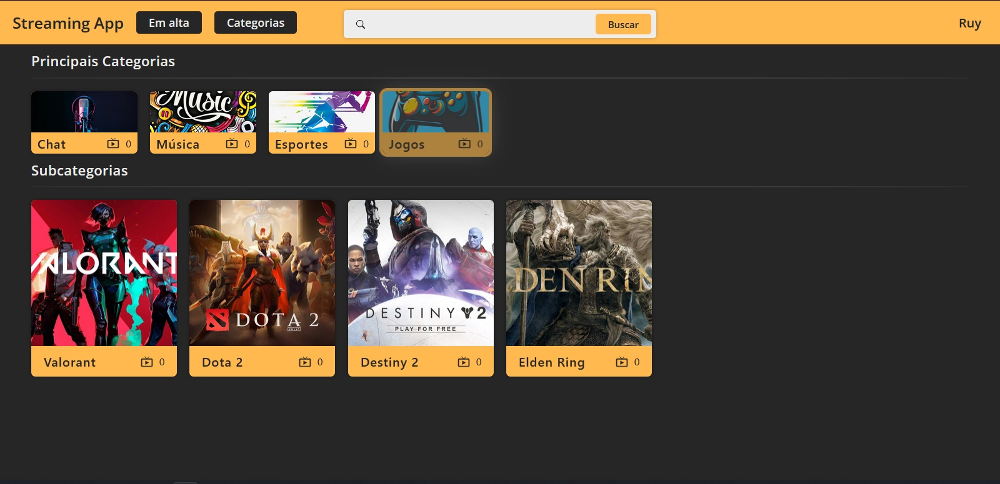
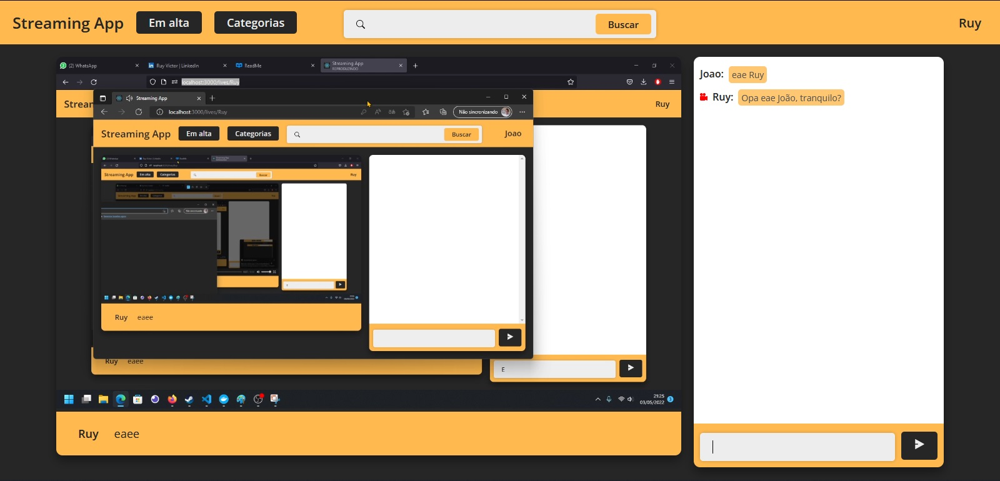
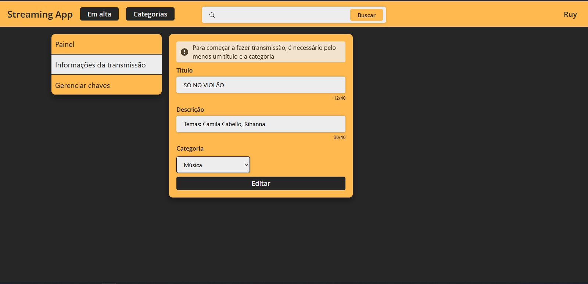

<h1 align="center">
    Streaming Frontend
</h1>

<span>
<div align="center">



</div>
</p>

# Projeto

Projeto de TCC orientado a plataforma de streaming (entretenimento).

# Tecnologias

- React
- SocketIO
- HLS Player

### Executar aplicação em desenvolvimento:
```
$ yarn
$ yarn start
```